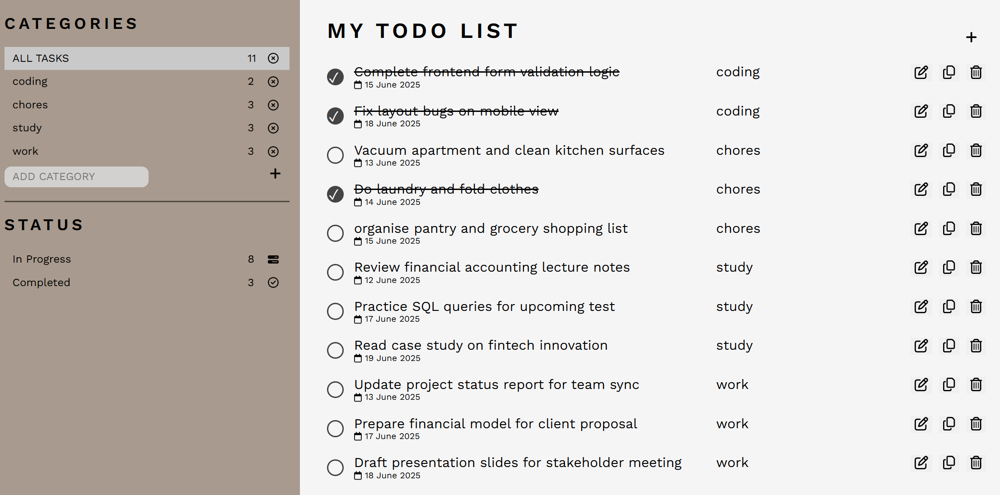
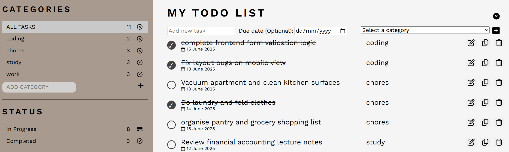
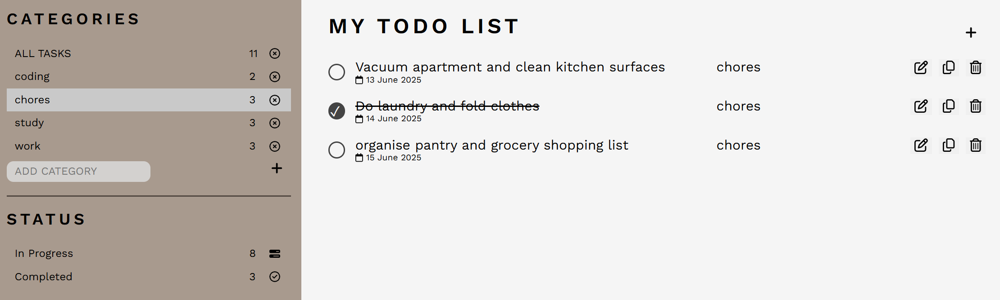
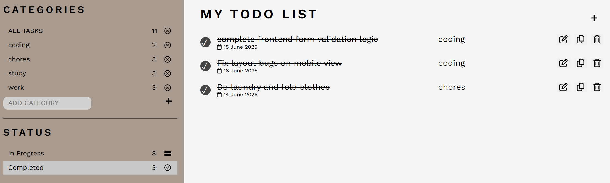

# 📝 Tasker

Tasker is a full-stack to-do list application that allows users to create, update, complete, and delete tasks. The app features a polished and responsive frontend built with React + TypeScript, a Java Spring Boot backend, and a MySQL database.

## Tech Stack

- **Frontend**: React, TypeScript, React Hook Form, React Testing Library
- **Backend**: Java, Spring Boot, Spring Data JPA
- **Database**: MySQL

## Contents Table

- [Features](#features)
- [Screenshots](#screenshots)
- [Goals of the Project](#goals-of-the-project)
- [Setup Instructions](#setup-instructions)
- [Project Approach](#project-approach)
- [Challenges](#challenges)
- [Future Improvements](#future-improvements)

## Features

Frontend (React + TypeScript):

- Add, edit, complete, and delete tasks
- Organized by categories
- Form validation and error handling: Implemented form validation using **React Hook Form** combined with **Zod** schema validation for robust and type-safe input handling
- Tested using React Testing Library

Backend (Spring Boot):

- RESTful API with full CRUD functionality
- Input validation and exception handling
- Returns appropriate status codes and meaningful messages
- MySQL database integration

## Screenshots

- An example of a to-do list with tasks:
  

- An example of adding a task:
  

- An example of filtering tasks by category:
  

- An example of filtering for completed tasks:
  

## Goals of the Project

- Practice full-stack development from scratch
- Implement robust error handling across layers
- Perform end-to-end CRUD operations
- Integrate React-Testing Library to test frontend functionality. and backened unit and end-to-end testing
- Build a clean and user-friendly UI

## Setup Instructions

### Backend

**1. Install and configure prerequisites:**

- Java Development Kit: https://www.oracle.com/au/java/technologies/downloads/
- Apache Maven: https://maven.apache.org/download.cgi
- MySQL: https://dev.mysql.com/downloads/installer/

**2. Clone the repo**:

```bash
git@github.com:rebeccaw628/todos.git
cd tasker/backend
```

**3. Configure MySQL:**

- Log in to MySQL (can also be done within the MySQL workbench)

```bash
mysql -u root -p
```

- Create a new database:

```sql
CREATE DATABASE your_database_name;
```

**4. Configure the application properties:**

- Navigate to the src/main/resources directory

- Create an **application.properties** file and add the following configuration:

```properties
spring.application.name=todo
spring.datasource.url=jdbc:mysql://localhost:3306/your_database_name
spring.datasource.username=your_username
spring.datasource.password=your_password
spring.jpa.hibernate.ddl-auto=update
spring.jpa.show-sql=true
spring.jpa.properties.hibernate.format_sql=true
spring.jpa.properties.dialect=org.hibernate.dialect.MySQLDialect
spring.profiles.active=dev
```

**5. Install Dependencies:**

```sh
mvn clean install
```

**6. Run the application:**

- Use the following command to run the application:

```sh
mvn spring-boot:run
```

**7. Set up frontend:**

- Follow the instructions to set up the frontend below. Once done, the application should be up and running

### Frontend

**1. Build Steps**

- After cloning the repository per instructions above, run the following commands:

```
npm install
```

```
npm run dev
```

**Note:** To use this application correctly, you must have the backend and database setup and running correctly.

## Project Approach

- User-Centric Minimalism: Tasker was designed with a strong focus on minimalism and usability. The goal was to create a clean, intuitive interface that allows user interaction with minimal visual clutter.

- Real-Time Feedback via Toasts: To enhance user experience, I integrated toast notifications to provide immediate feedback on user actions (e.g., successful updates or deletions). These were styled to align with the app's overall aesthetic and implemented in a lightweight, efficient way.

- Maintainable Architecture: While the core functionality of this application is relatively straightforward, I focused on applying clean and scalable coding practices. This included using React Context to manage global state and avoid prop drilling, modularising components for scalability, and maintaining clear separation of concerns throughout the codebase.

- Single Page Application (SPA) Design: The entire app was built as a SPA to ensure fast load times and a smooth, uninterrupted user experience without unnecessary page reloads or routing complexity.

- Scalability in Mind: The structure of the application allows for easy extension — such as adding pagination, changing the way filtering is performed — without major refactoring.

## Challenges

**State and Context Synchronization**

- Ensuring the UI remained in sync with data after user actions such as adding, updating, or deleting tasks required careful state management
- React Context was used to avoid excessive prop drilling and manage shared state across components

**Ensuring Data Consistency**

- Keeping the frontend and backend in sync involved implementing reliable patterns for fetching and updating data

**Implementing Single Responsibility Principle**

- Clearly separating concerns across layers

**Testing with Mockito**

- Learning concepts such as stubbing, verifying interactions, and intercepting method calls
- This was a valuable learning curve that helped me appreciate how Mockito fits into unit testing by simulating controlled behaviors and validating method interactions

## Future Improvements

- Implementing pagination and filtering in backend
- Allowing the user to select between the option of creating a new category or choosing from an existing category when creating a new task
